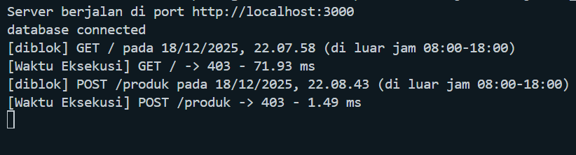
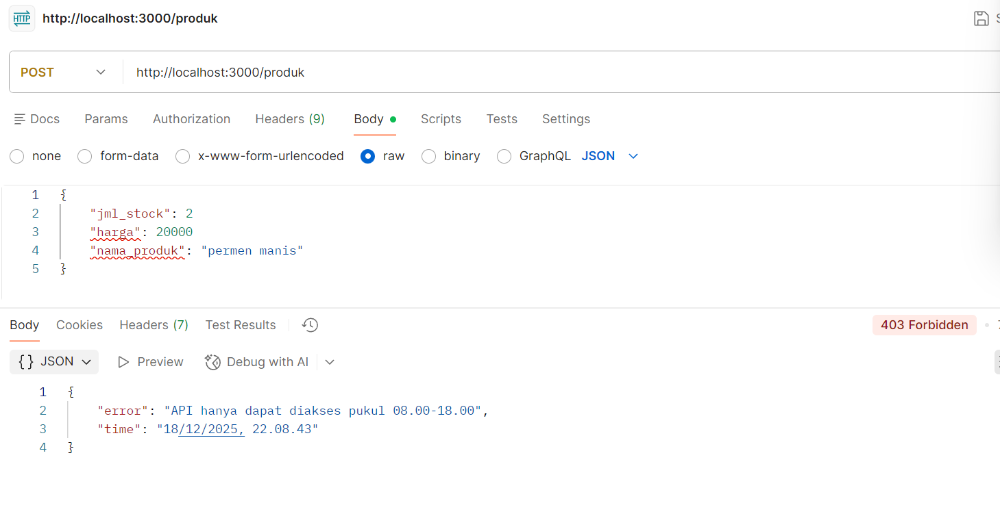

## tugas PBP sesi 11

Berdasarkan praktikum yang telah dikerjakan, tambahkan fungsi berikut ini:

1. Buat middleware yang menghitung waktu eksekusi request dan menampilkannya di console.
2. Tolak request jika API diakses di luar jam 08.00 – 18.00.
3. Upload script pada github dan lampirkan screenshoot hasil pengujiannya.

# dikerjakan oleh

- Nama : Latip
- NIM : 20240040036

# lampiran hasil

pengujian di console

pengujian di postman  

